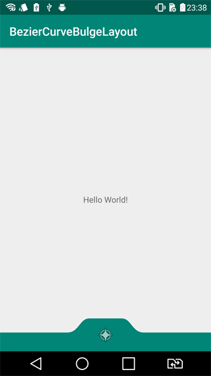
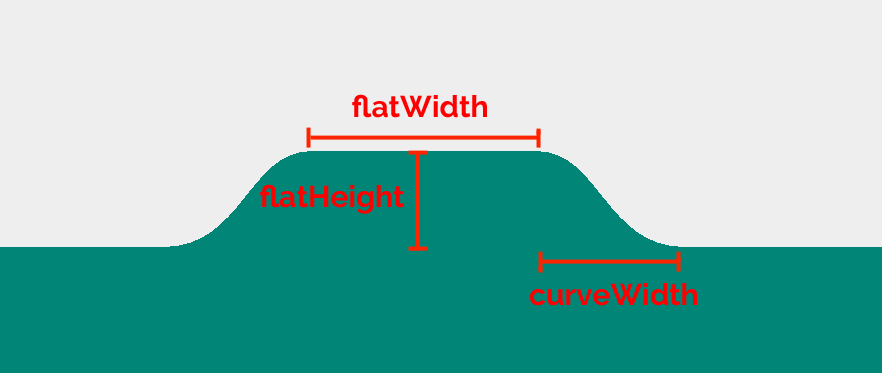

# BezierCurveBulgeLayout
BezierCurveBulgeLayout makes a layout just like google pay.

```xml
<com.aminography.beziercurvebulgelayout.BezierCurveBulgeLayout
    android:id="@+id/bulgeLayout"
    android:layout_width="match_parent"
    android:layout_height="56dp"
    android:layout_gravity="bottom"
    app:bulgeType="bulge"
    app:bulgeColor="@color/colorPrimary"
    app:curveWidth="32dp"
    app:flatWidth="56dp"
    app:flatHeight="24dp">

    <android.support.v7.widget.AppCompatImageView
        android:layout_width="wrap_content"
        android:layout_height="wrap_content"
        android:layout_gravity="center"
        android:src="@android:drawable/ic_menu_compass"/>

</com.aminography.beziercurvebulgelayout.BezierCurveBulgeLayout>
```




